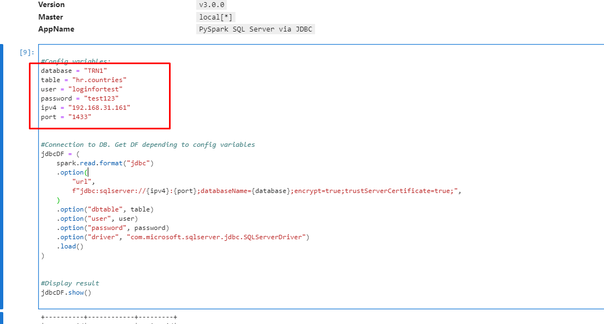
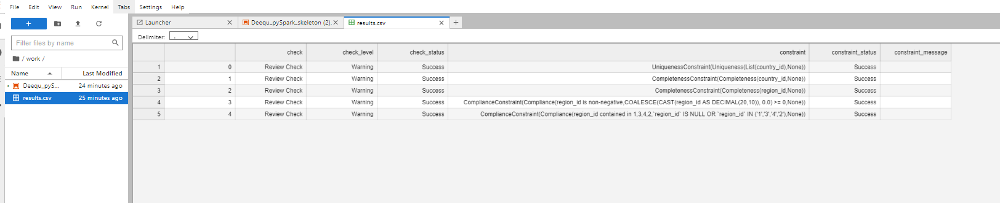

# Deequ Test Task

Data Quality Engineering - Deequ test task

# Steps fot setup
1. Setup environment. Add jdbc driver to folder with jars(spark_version=3.0.0)
2. Create new login in MS SQL SMS. Save username, password, servername and name of DB.
       
3. Update values in project from previous step:
    
4. Install pydequ via pip on docker container.
5. Deequ_pySpark_skeleton.ipynb in docker container.

# Report example
It's preview:
    

You can look at whole report by open [this file](https://github.com/YGordiychuk/DeequTestTask/results.csv).

# If not work and problem like from db side:
1. Check settings in  SQL Server Configuration Manager -> SQL Server Network Configuration -> Protocols for <SQLEXPRESS> -> TCP/IP Properties -> IP Addresses
2. At least one ip address may be active and enabled 

